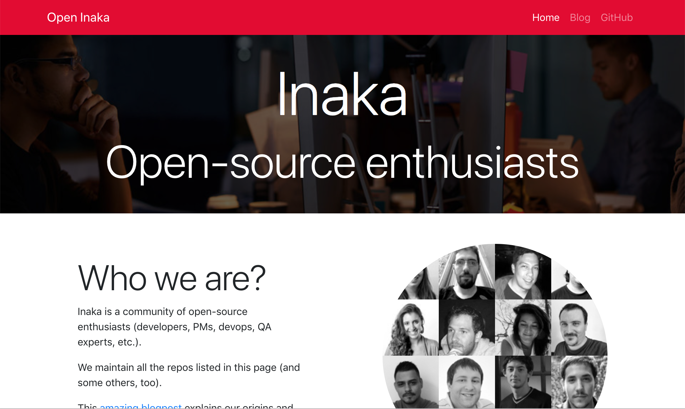

# INAKA Comunity Website




This is the inaka comunity website. To preview it, run the following

```
npm install
npm run serve
```

# To Update the Site content with github data
```
npm run build
```

# Important

If you are using parcel to work with the site("npm run serve"), the site wil NOT auto update when you change a file. This is because a bug in parcel that prevents it to dettect changes when the containing folder have dots (like in inaka.github.io). To fix it, rename the folder to inaka-github-io.

The changes will not be shown on the site until you *merge to master*. The default branch is dev. Keep that in mind if you are maintaining the site. 

